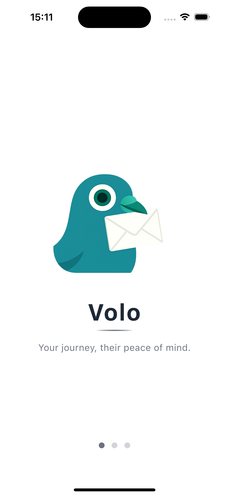
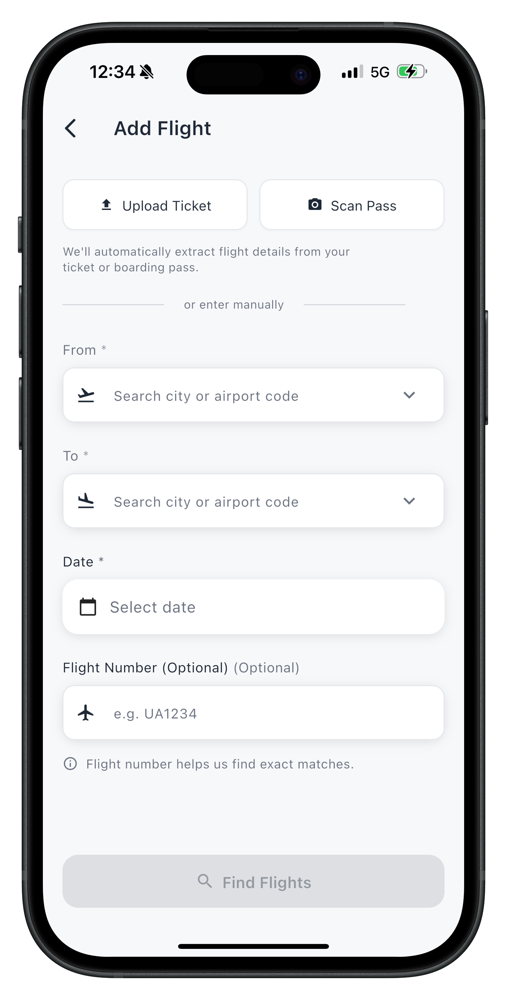
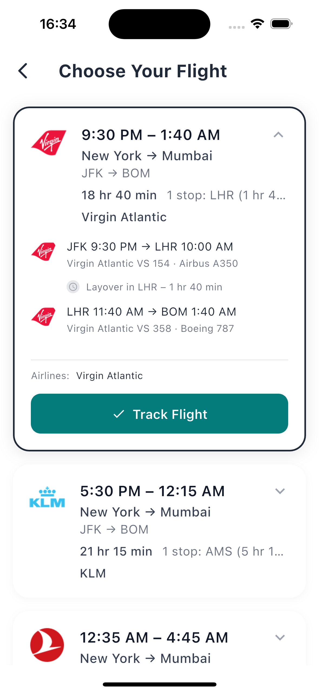
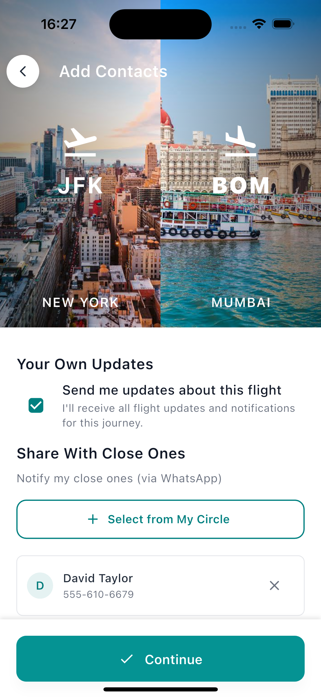
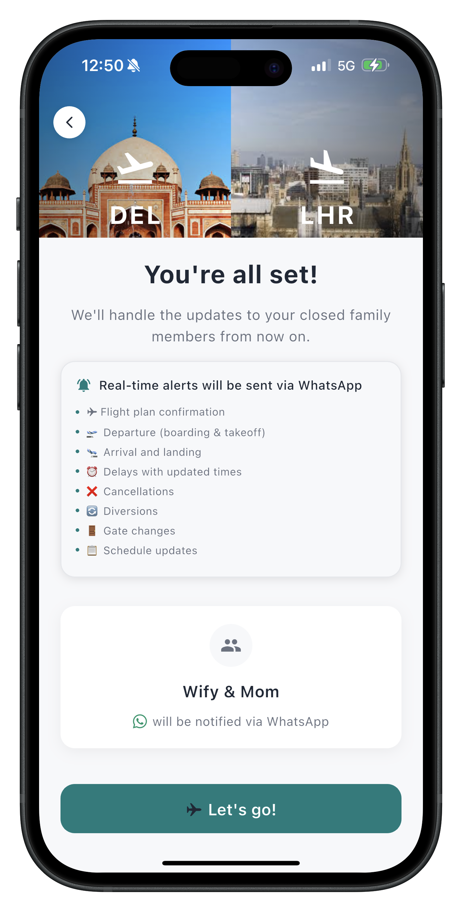
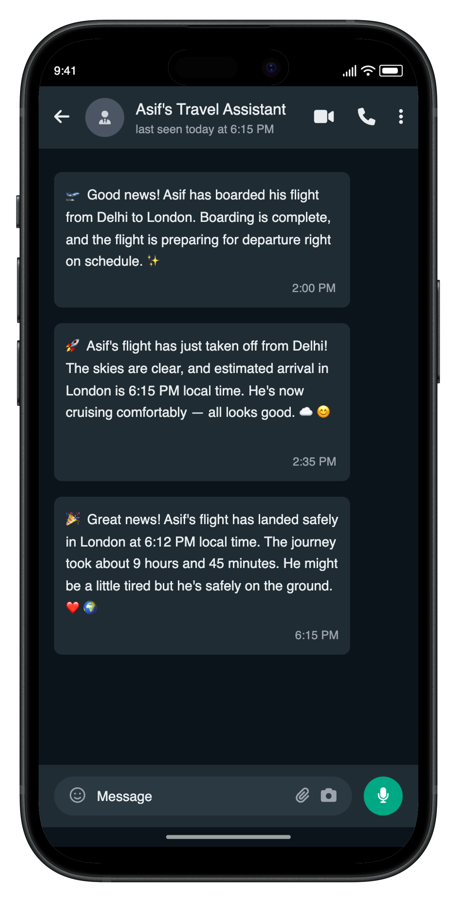

# Volo ✈️

**Volo** — your personal travel assistant that keeps your loved ones informed about your flights.

## What is it?

When you travel, simply add your flight details to Volo and the app automatically updates your close family or friends via WhatsApp messages — from boarding to landing, with real-time updates on delays and other important changes.

## How it helps

- **Simple**: Enter your flight once; Volo handles the rest
- **Reassuring**: Your close circle stays informed automatically  
- **Private**: You choose exactly who gets notified
- **Real-time**: Live updates throughout your journey

## How it works

1. **Add a flight** (from/to/date and optional flight number)
2. **Pick who should be notified** from your contacts
3. **Volo sends helpful WhatsApp updates** as your journey progresses

## App Screenshots

Here's the complete user journey through Volo:

### 1. Splash Screen

*Welcome to Volo - your personal travel assistant*

### 2. Flight Search Screen

*Search for flights with departure, arrival, and date selection*

### 3. Flight Results Screen

*Browse available flights with airline details and pricing*

### 4. Add Contact Screen

*Select who receives your flight updates via WhatsApp*

### 5. Information Screen

*Confirmation with flight details and notification settings*

### 6. WhatsApp Screen

*Real-time flight updates sent to your contacts via WhatsApp*

---

## App Flow

| 1. Splash | 2. Flight Search | 3. Flight Results |
|-----------|------------------|-------------------|
|  |  |  |
| Welcome screen | Enter flight details | Browse available flights |

| 4. Add Contacts | 5. Information | 6. WhatsApp |
|-----------------|----------------|-------------|
|  |  |  |
| Select notification recipients | Confirmation & settings | Real-time updates |

## Technology Stack

- **Frontend**: Flutter (cross-platform mobile development)
- **Platforms**: Android & iOS
- **Backend**: Custom API with real-time flight data
- **Integration**: WhatsApp Business API for notifications
- **Architecture**: Clean Architecture with Riverpod state management

## Key Features

- 🔍 **Real-time Flight Search**: Live flight data with airline information
- 👥 **Contact Management**: Select who receives your updates
- 📱 **WhatsApp Integration**: Automatic notifications via WhatsApp
- 🎨 **Modern UI**: Clean, intuitive interface with real airport images
- 🔄 **Real-time Updates**: Live flight status and delay notifications

## Status

🚧 **Work in Progress** - Core functionality is implemented and working. The app successfully:
- Searches for flights using real API data
- Displays flight results with airline logos
- Manages contacts and flight tracking
- Integrates with WhatsApp for notifications

## Getting Started

1. Clone the repository
2. Install Flutter dependencies: `flutter pub get`
3. Run the app: `flutter run`

## License

MIT License — see `LICENSE` file for details.

---

**Built with ❤️ for travelers and their loved ones**
